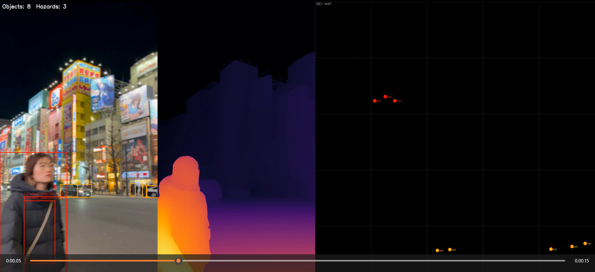
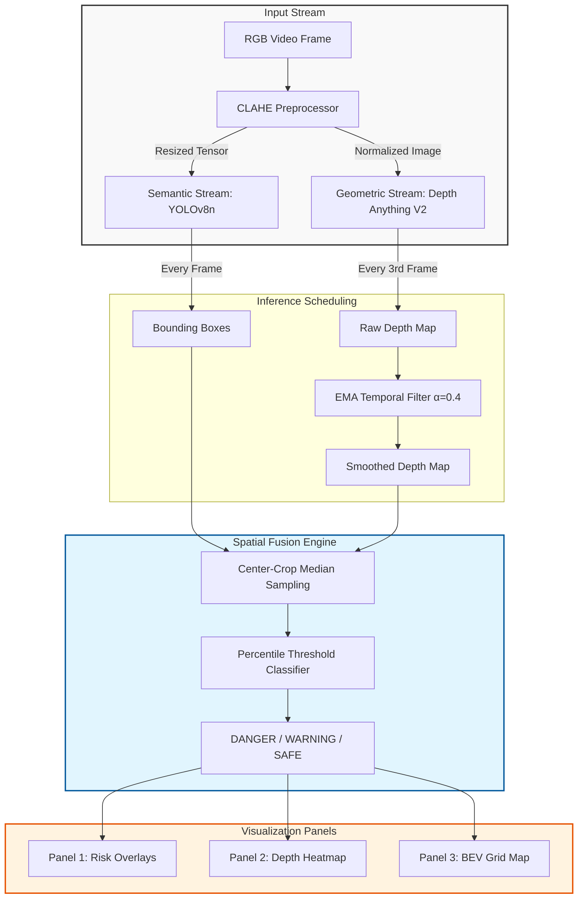

# MONOCULAR // Spatial Risk Engine

[](https://opensource.org/licenses/MIT)
[](https://www.python.org/downloads/)
[](https://opencv.org/)
[](https://huggingface.co/spaces/strelizi/monocular-depth-risk)

**MONOCULAR** is a real-time visual-spatial intelligence system that fuses monocular depth estimation with semantic object detection to perform 3D-aware collision risk assessment from a single RGB camera — no LiDAR, no stereo rig, no calibration required.



---

## System Visualization

Three-panel synchronous spatial telemetry output:

- **Left — Semantic Detection:** YOLOv8n bounding boxes with dynamic DANGER / WARNING / SAFE hazard overlays and EMA-smoothed risk scores
- **Center — Latent Depth Map:** Per-frame relative depth visualized via INFERNO colormap (Depth Anything V2, ViT-Small)
- **Right — Bird's Eye View:** Top-down 2D spatial grid mapping object proximity and lateral orientation relative to camera

---

## Core Technical Features

**Pseudo-LiDAR Projection**
Translates 2D bounding boxes and relative depth estimates into a top-down (X, Z) coordinate space, plotting detected objects relative to the camera origin on a BEV grid.

**Scene-Adaptive Risk Thresholding**
Hazard levels evaluated dynamically per frame using percentile-based cuts — top 30% depth = DANGER, next 30% = WARNING — adapting automatically to scene scale without hard-coded distance limits or camera calibration.

**Decoupled Multi-Queue Inference**
YOLOv8n runs at full frame rate; Depth Anything V2 executes on a 1:3 frame ratio with spatial-temporal depth map reuse across intermediate frames, achieving ~15-20 FPS on T4 GPU.

**EMA Temporal Smoothing**
Exponential Moving Average (α=0.4) applied to depth maps across frames, eliminating frame-to-frame flicker and producing production-stable risk score transitions.

**Center-Weighted Median Sampling**
Depth extracted exclusively from the central 50% of each bounding box crop, eliminating edge boundary artifacts and background depth leakage common in monocular depth models.

**CLAHE Preprocessing**
Contrast Limited Adaptive Histogram Equalization applied to input frames in LAB color space before depth inference — improves model robustness on low-light and high-contrast scenes.

---

## System Architecture



---

## Evaluation

Depth ordering accuracy evaluated on **NYU Depth V2** (n=100 test images, zero-shot, no fine-tuning):

| Metric | Value | Notes |
|--------|-------|-------|
| Spearman ρ | **0.8894** | Depth ordering correlation — directly validates risk tier logic |
| AbsRel | 0.1769 | After min-max inversion + median scale alignment |
| Eval set | NYU Depth V2 | 100 images sampled uniformly across 1449 labeled frames |

> Spearman ρ = 0.89 means the model correctly ranks depth relationships 89% of the time. Since MONOCULAR's risk system depends on relative ordering rather than metric depth, Spearman is the primary validity metric.

**On quantization:** Dynamic INT8 quantization via ONNX Runtime produced a 0.54x slowdown on this ViT-Small backbone — attention-compute bottleneck dominates over weight-loading time. Static quantization with calibration data is the correct path for edge deployment.

---

## Performance

| Dimension | Value |
|-----------|-------|
| Depth Engine | Depth Anything V2 Small (ViT-S, 62M image pretraining) |
| Detection | YOLOv8n (Ultralytics, ~3.2M params) |
| Throughput | ~15-20 FPS on T4 GPU |
| Depth inference | Every 3rd frame with EMA reuse |
| Risk tiers | DANGER (red) / WARNING (orange) / SAFE (green) |
| Preprocessing | CLAHE in LAB space |
| Temporal smoothing | EMA α=0.4 |

---

## Project Structure

```
monocular/
├── app.py                  # Gradio web app (HuggingFace Spaces)
├── depth.py                # Local video inference + BEV pipeline
├── requirements.txt
└── README.md
```

---

## Local Setup

```bash
git clone https://github.com/0AnshuAditya0/monocular
cd monocular
python -m venv venv
venv\Scripts\activate      # Windows
# source venv/bin/activate # Linux/Mac
pip install -r requirements.txt
python depth.py
```

---

## Live Demo

[huggingface.co/spaces/strelizi/monocular-depth-risk](https://huggingface.co/spaces/strelizi/monocular-depth-risk)

Upload any street, traffic, or indoor image. The system assigns DANGER / WARNING / SAFE labels to every detected object based on estimated depth.

---

## Known Limitations

- **Relative depth only** — no metric distances without camera intrinsic calibration. For metric BEV, inverse projection `X = (u - cx) * Z / fx` requires known focal length.
- **Scale ambiguity** — a toy car 0.5m away may receive similar depth estimate as a real car 10m away
- **Transparent surfaces** — glass, water, and textureless regions degrade depth accuracy
- **ViT quantization** — dynamic INT8 degrades performance; static quantization with calibration needed for edge deployment

---

## Author

**Anshu Aditya** — OpenCV Contributor (5 merged PRs across imgproc, SIMD, Python bindings, VideoIO, HighGUI)

[GitHub](https://github.com/0AnshuAditya0) · [LinkedIn](https://linkedin.com/in/anshu-aditya) · [OpenCV PRs](https://github.com/opencv/opencv/pulls?q=author%3A0AnshuAditya0)